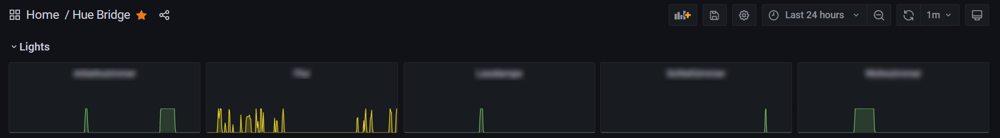
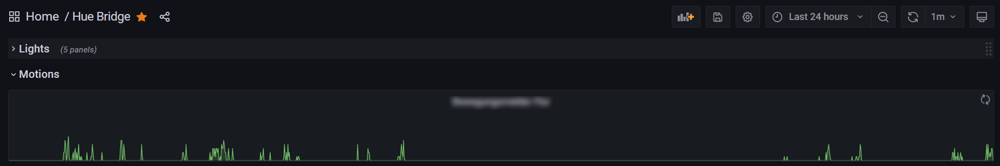
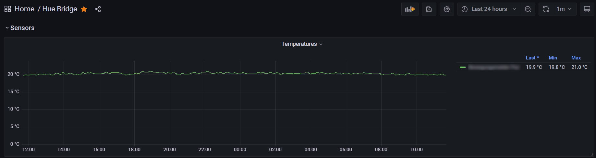
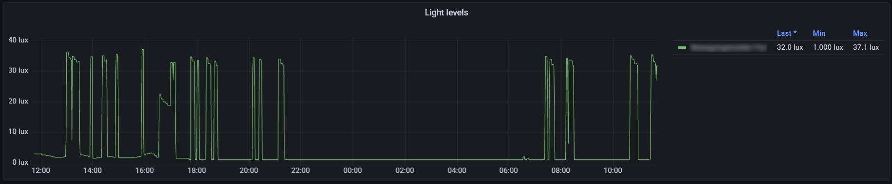
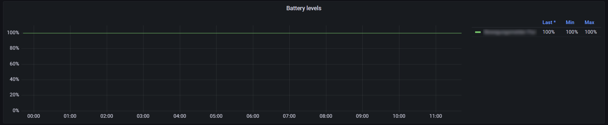

## About huebridge-telegraf-plugin
This [Telegraf](https://github.com/influxdata/telegraf) input plugin gathers stats from [Hue Bridge](https://www.philips-hue.com/) devices. It uses the device's [CLIP API](https://developers.meethue.com/develop/hue-api-v2/) interface to retrieve the stats. Lights status as well as Motion sensor data is retrieved.

### Installation
To install the plugin you have to download a suitable [release archive](https://github.com/hdecarne-github/huebridge-telegraf-plugin/releases) and extract it or build it from source by cloning the repository and issueing a simple
```
make
```
To build the plugin, Go version 1.16 or higher is required. The resulting plugin binary will be written to **./build/bin**.
Copy the either extracted or built plugin binary to a location of your choice (e.g. /usr/local/bin/telegraf/).

### Configuration
This is an [external plugin](https://github.com/influxdata/telegraf/blob/master/docs/EXTERNAL_PLUGINS.md) which has to be integrated via Telegraf's [excecd plugin](https://github.com/influxdata/telegraf/tree/master/plugins/inputs/execd).

To use it you have to create a plugin specific config file (e.g. /etc/telegraf/huebridge.conf) with following template content:
```toml
[[inputs.huebridge]]
  ## The Hue bridges to query (multiple tuples of base url, application key)
  ## To create a application key issue the following command line for the targeted Hue bridge:
  ## curl -X POST http://<bridge IP or DNS name>/api -H 'Content-Type: application/json' -d '{"devicetype":"huebridge-telegraf-plugin"}'
  bridges = [["https://<insert IP or DNS name>", "<insert application key>"]]
  ## The http timeout to use (in seconds)
  # timeout = 5
  ## Enable debug output
  # debug = false
```
The most important setting is the **bridges** line. It defines the base URLs of devices to query as well as the application key to use for authentication. At least one device has to be defined.

To enable the plugin within your Telegraf instance, add the following section to your **telegraf.conf**
```toml
[[inputs.execd]]
  command = ["/usr/local/lib/telegraf/huebridge-telegraf-plugin", "-config", "/etc/telegraf/huebridge.conf", "-poll_interval", "10s"]
  signal = "none"
```

#### Lights stats
Lights stats are reported via the **huebridge_light** measurement:
```
huebridge_light,huebridge_device=Lamp\ 1,huebridge_room=Room\ 1,huebridge_url=https://huebridge1.local on=0i 1651298875981339000
```
Every light is reported including the corresponding device and room name (if assigned). The on value indicates the state (0: off 1: on).



#### Motion stats
Motion stats are reported via the **huebridge_motion** measurement:
```
huebridge_motion,huebridge_device=Motion\ sensor\ 1,huebridge_url=https://huebridge1.local motion=0i 1651300700769486000
```
Every motion sensor is reported including the corresponding device. The motion value indicates the state (0: No motion 1: Motion detected).



#### Temperature stats
Temperature stats are reported via the **huebridge_temperature** measurement:
```
huebridge_temperature,huebridge_device=Motion\ sensor\ 1,huebridge_url=https://huebridge1.local temperature=20.030000686645508 1651300700525983000
```
Every temperature sensor is reported including the corresponding device.



#### Light level stats
Light level stats are reported via the **huebridge_light_level** measurement:
```
huebridge_light_level,huebridge_device=Motion\ sensor\ 1,huebridge_url=https://huebridge1.local light_level=6551,light_level_lux=4.518559443749223 1651300700650794000
```
Every light level sensor is reported including the corresponding device. The actual level value (light_level) as well as it's correspondig lux value (light_level_lux) is reported.



#### Device power stats
Device power stats are reported via the **huebridge_device_power** measurement:
```
huebridge_device_power,huebridge_device=Motion\ sensor\ 1,huebridge_url=https://huebridge1.local battery_level=100i 1651342467380821000
```



### License
This project is subject to the the MIT License.
See [LICENSE](./LICENSE) information for details.
